[](https://creativecommons.org/licenses/by-nc-sa/4.0/legalcode)

# GeoStructure: Semi-Automatic Fracture Orientation Extraction from Point Clouds, using Machine Learning and Region Growing

This is the official implementation of GeoStructure, an algorithmic software pipleine designed to extract Fracture Orientation (FO) measurements from a [software generated] point cloud. Data is cleaned of outliers using a Mahalanobis distance method, segmented using a *k*NN Region Growing technique and FOs (Strike, Dip Angle, Dip Direction) determined using Direction Cosines method. For technical details, please refer to:

Towards an Automatic System for Extracting Fracture Orientations from Software Generated Point Clouds [paper]
Fracture Orientation Extraction from Software Generated Point Clouds [thesis]


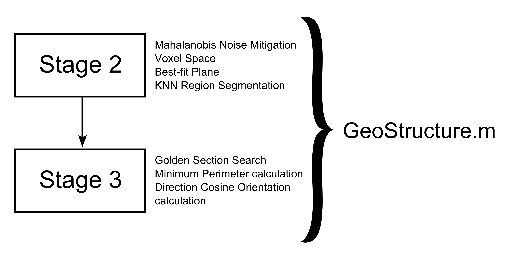

<p float="left">
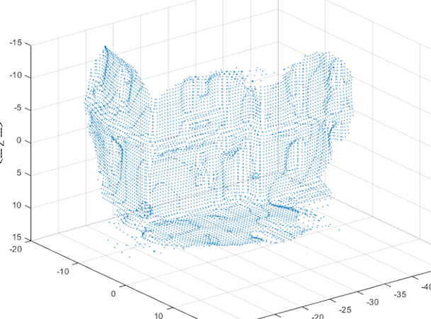
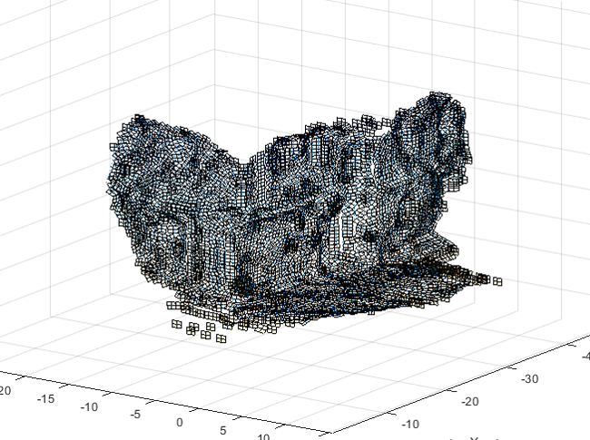
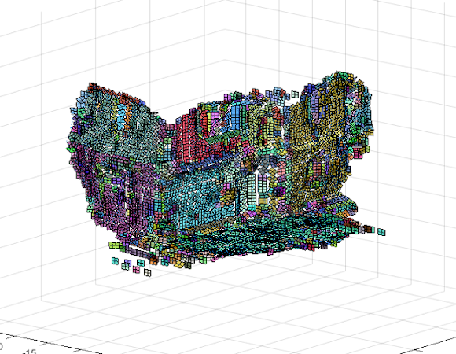
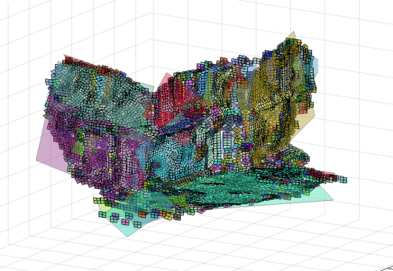
</p>

## (1) Setup

This code has been written in MATLAB 2016 but is tested and works with the lateest version. A full MATLAB installation is preferred but not mandatory (NOTE: some specialist toolboxes may be required). Code is OS agnostic and self-contained, that is, dependent on no outside libraries or computing languages. However, please also be aware that although I attempted to design this work in a universally usable fashion, that ultimately this is *research software*. As such, there are some nuances in the design and functionality that will only be apparent after study of the code. Instructions to get you going are below:

* Clone the repository

``` git
git clone https://github.com/jkissi/GeoStructure.git
```

* In the MATLAB prompt change directory and run startup script 

``` matlab
cd GeoStructure
startup
```
* Running the `startup.m` script should ensure that the pipeline folders are in the local path


## (2) Usage

* Modify program variable factors and graph outputs from `Experimental_Framework.m` file. Read comments in the `Experimental_Framework.m` file for detailed explanations. Then run:

  
``` matlab
Experimental_Framework 
```
from the Matlab prompt.

* Pipeline flags and switches are located in `newGeo_Struct.m` file. This acts as a datastructure that is passed through the pipeline as it runs. All modified data values for objects are retained in the object it creates. The pipeline is complex, it may take some time to understand what is going on, but it is designed to "just run" with the default data contained in the input directory.


### (3) Obtain FO measurements

* After run is complete, go to the output directory and open the figure that ends in `_complete.fig`. Click on the Region Planes visible to see what the algorithm determined their FO measurements to be. 

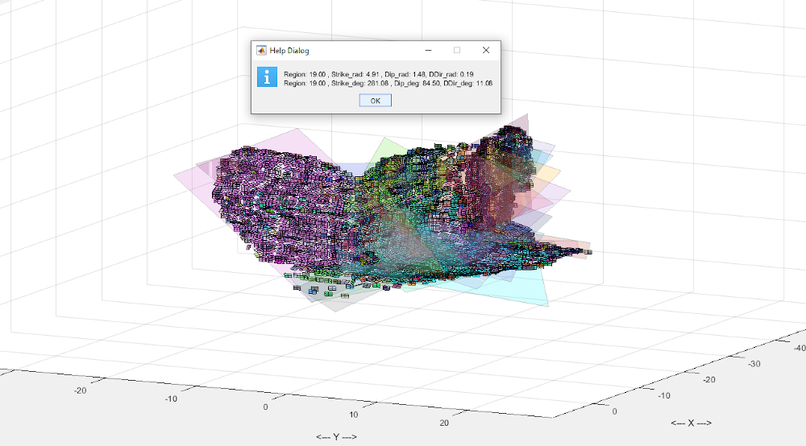

* Simply click on the illustrated planes to open a dialog with the measured Strike, Dip and Dip Direction information 


### (3) Get Accuracy Score (z)

* In order to collate final data from the complete experimental run and plot, there are several stages:

*  If you desire information on the accuracy of the final output, ensure that you include at least one *ground truth* measurement from the target that the point cloud represents

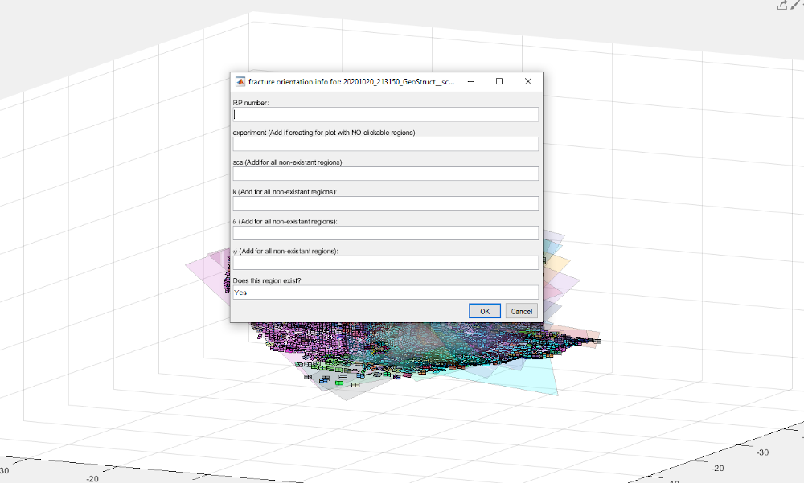

* To obtain accuracy information, click a region plane, then select obtain accuracy information from the following dialog, then if you want to plot the files and aggregate the text files produced 

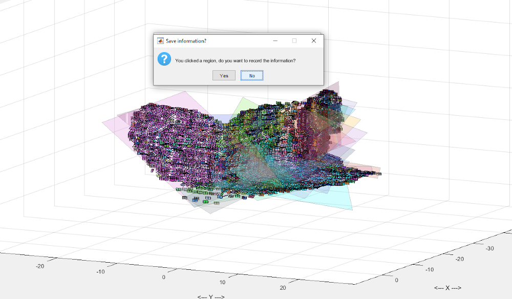


* The pipeline deposits the region plane data into a human readable text file for each run

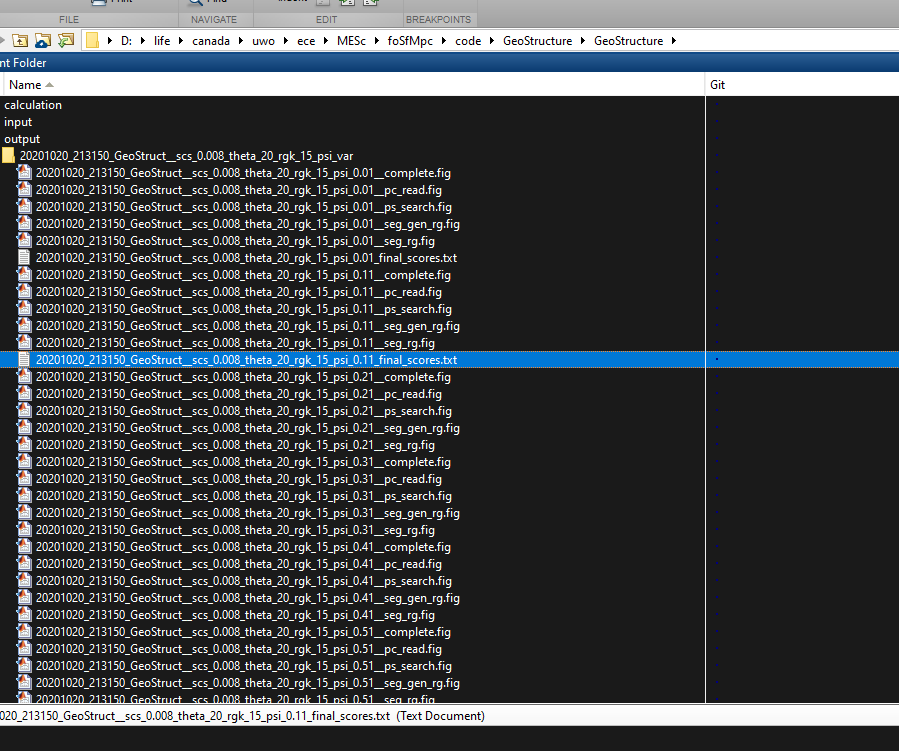

* The pipeline automatically aggregates the textfiles for each run into a single file and plots this data

* For output figures with region planes that correspond with ground truth specified in the `newGeo_Struct` object, simply indicate [the number of] the region plane which you have clicked (Ground truth region planes must be numbered in the `newGeo_Struct.m` file) and confirm the region exists by making sure 'Yes' is in the "region exists" field and click "OK"
<p float="left">

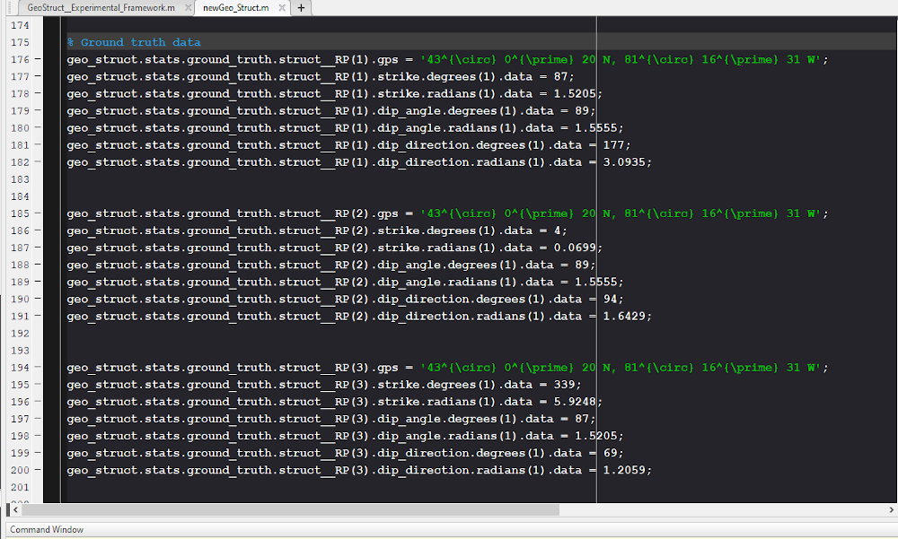
</p>
* Once a final_scores file has been made for every run of the experiment, on the final file of the run, click yes to aggregate the files. This collates the data into a single file

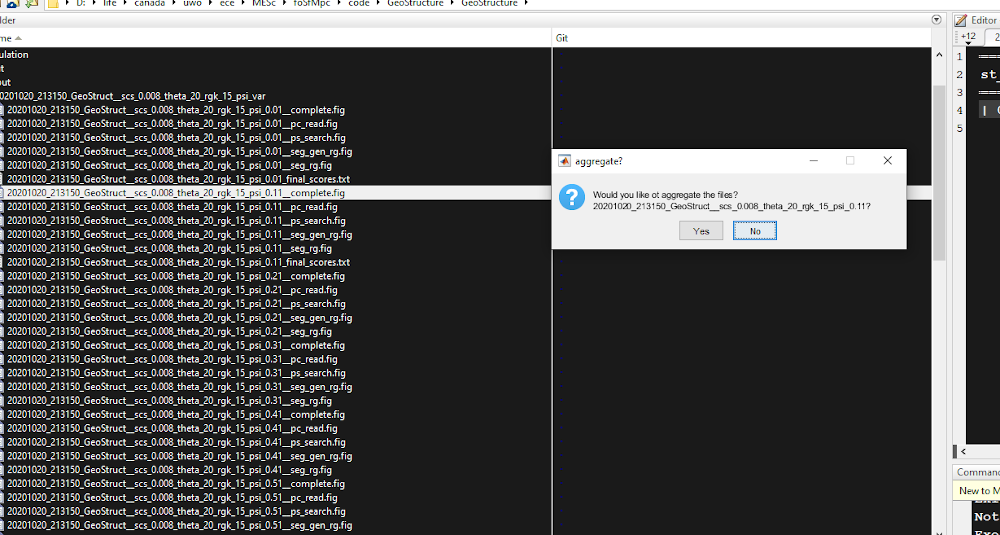

* If the Region you expected has NOT appeared in the output, click anywhere on the figure until the dialog appears. As well as placing the region number, ensure that you fill the fields with the experimental run variable factor numbers and set the region exist field to 'No'.


* If there are NO clickable regions on the plot, ensure that the fill experiment name in input EXACTLY in this field 


* Click Yes to get the final accuracy score

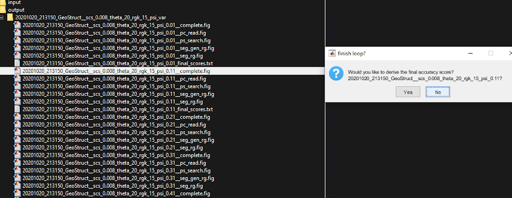

* And if you wish, click Yes to plot the files

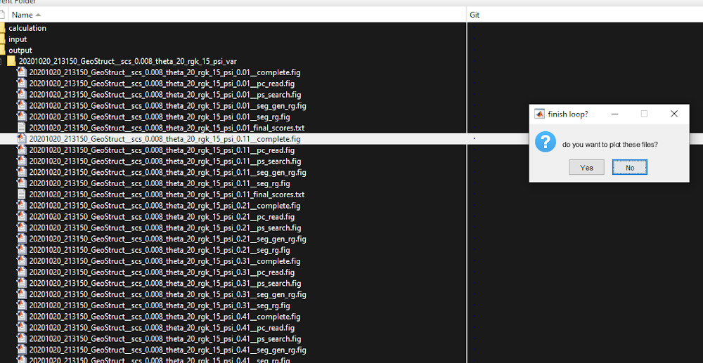


## (4) Directory Structure 

* Root - Run the pipeline
* ancilliary - functions that perform convenience tasks internal to the pipeline
* calculation - function that specilise in deriving specific standalone calculation
* best_fit_plane - functions related to the voxel fitting and plane fitting functions of the pipeline 
* input - input data and/or files. Contains a script directory that is currently unused
* output - output files produced by the pipeline
* point_cloud - functions related to the reading of the point cloud files and inputting of data into MATLAB data structures
* point_space - generates and modifies the point space for display of the cloud
* preprocessing - functions that perform convenience task external to the pipeline, particularly those to do with preprocessing
* search_space - functions that regulate the search of the point space during voxelisation 
* segmentation - function that regulate the region growing and designation process 
* statistics - functions that perform statistacal operations, such as plotting in storing output data in text files


### Citation
If you find our work useful in your research, please consider citing:

<!-- 
	@article{hu2019randla,
	  title={RandLA-Net: Efficient Semantic Segmentation of Large-Scale Point Clouds},
	  author={Hu, Qingyong and Yang, Bo and Xie, Linhai and Rosa, Stefano and Guo, Yulan and Wang, Zhihua and Trigoni, Niki and Markham, Andrew},
	  journal={Proceedings of the IEEE Conference on Computer Vision and Pattern Recognition},
	  year={2020}
	}
-->


### License
Licensed under the CC BY-NC-SA 4.0 license, see [LICENSE](./LICENSE).


<!--- 
```python
import foobar

foobar.pluralize('word') # returns 'words'
foobar.pluralize('goose') # returns 'geese'
foobar.singularize('phenomena') # returns 'phenomenon'
```
[//]: <> (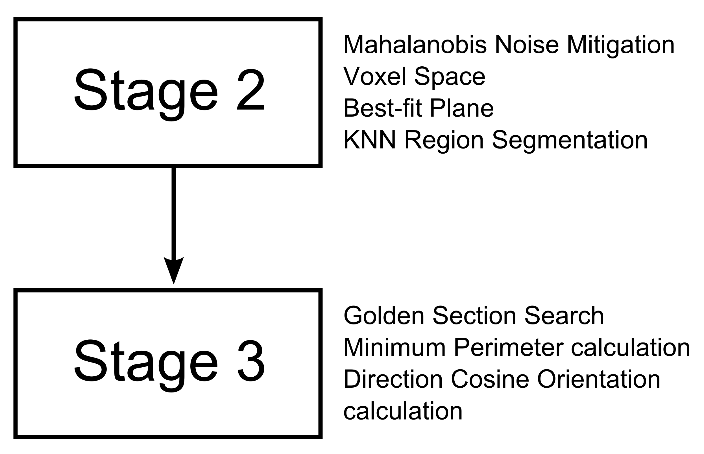)
[comment]: # 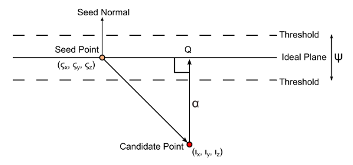
[comment]: # 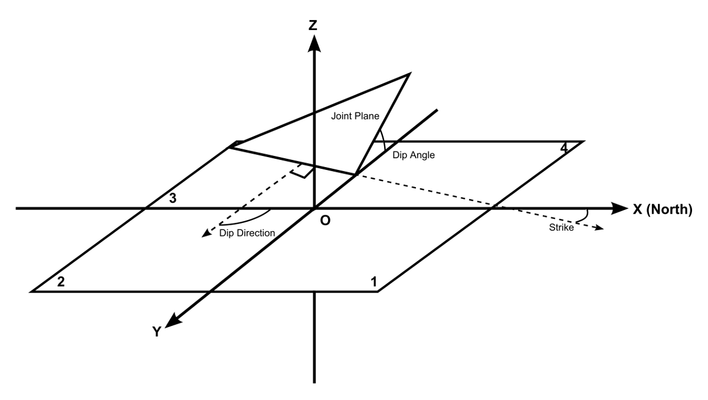
[comment]: # 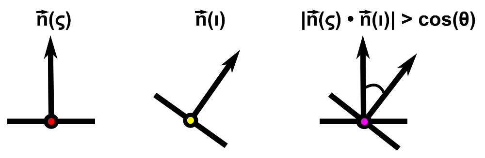


[comment]: # 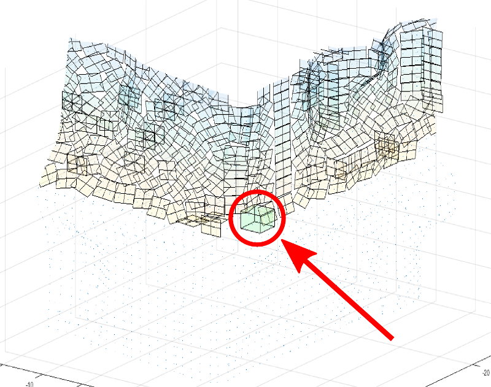
[comment]: # 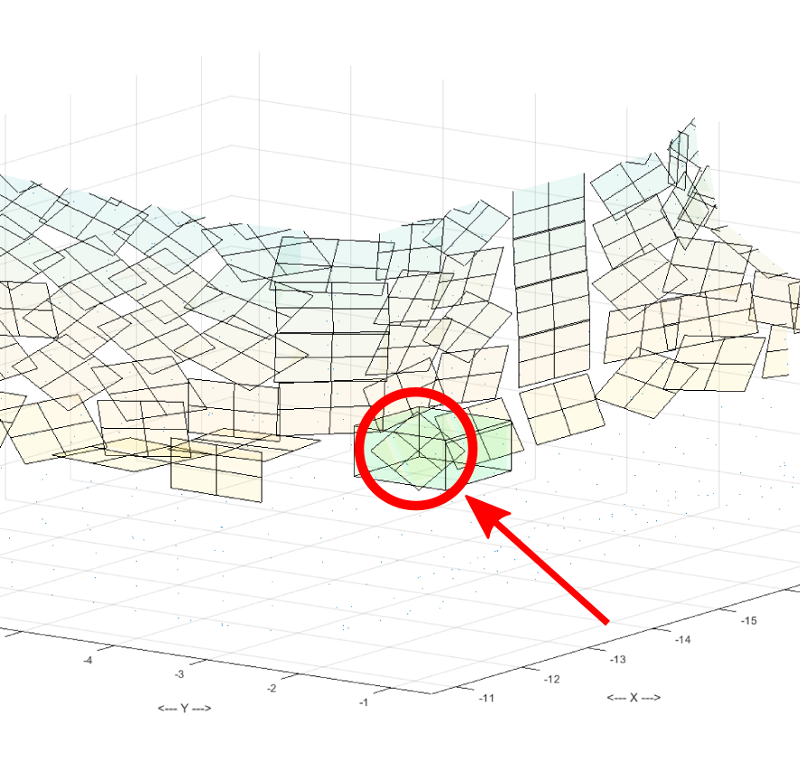
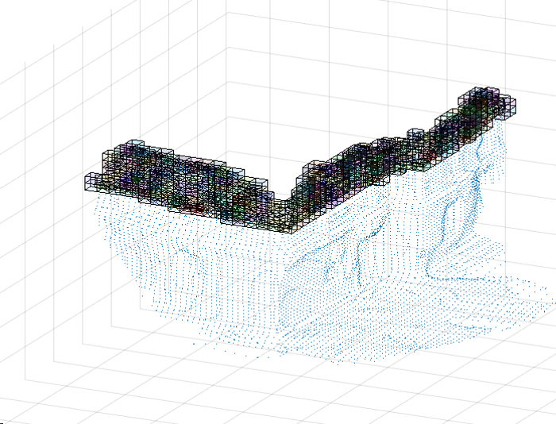

[Linky-linky](www.google.com)

-->