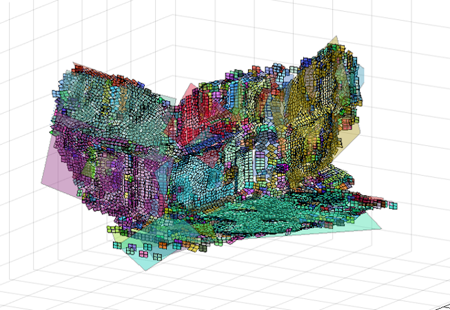
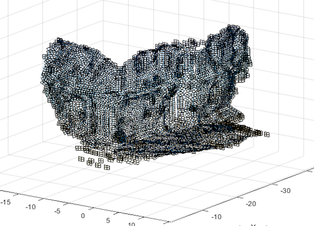

# GeoStructure: Semi-Automatic Fracture Orientation Extraction from Point Clouds, using Machine Learning and Region Growing

This is the official implementation of GeoStructure, an algorithmic software pipleine designed to extract Fracture Orientation measurements from a [software generated] point cloud. Data is cleaned of outliers using a Mahalanobis distance method, segmented using a kNN Region Growing technique and Fracture Orientations determined using Direction Cosines method. For technical details, please refer to:

Towards an Automatic System for Extracting Fracture Orientations from Software Generated Point Clouds
Fracture Orientation Extraction from Software Generated Point Clouds 

## (1) Setup

This code has been written in MATLAB 2016 but is tested and wroks with the lateest version. A full MATLAB installation is preferred but not mandatory (NOTE: some specialist toolboxes may be required). Code is OS agnostic and self-contained, that is, dependent on no outside libraries or computing languages but please also be aware although I attempted to design this work in a universally usable fashion, that ultimately this is *research software*. as such, there are some nuances in the design and functionality that will only be apparent after study of the code. Instructions to get you going are below:

* Clone the repository

``` git
git clone https://github.com/jkissi/GeoStructure.git
```

* In MATLAB prompt change directory and run startup script 

``` matlab
cd GeoStructure
startup
```
* Running the startup script should ensure that the pipeline folders are in the local path

## Usage

* Modify program variable factors and graph outputs from Experimental_Framework file. Read comments for detailed explanations. Then run:
``` matlab
Experimental_Framework 
```
from the Matlab prompt.

* Pipeline flags and switches are located in newGeo_Struct file. This act as a datastructure that is passed through the pipeline as it runs. All modified data values for objects are retained in the object it creates. The pipeline is complex, it may take some time to understand what is going on, but it is designed to "just run" with the default data contained in the input directory.
* After run is complete, go to the output directory and open the figure that ends in _complete.fig. Click on the Region Planes visible to see what the algorithm determined their FO measurements to be. 


#### File Structure 

* Root
* ancilliary
* calculation
* best_fit_plane
* input
* output
* point_cloud
* point_space
* preprocessing
* search_space
* segmentation
* statistics


```python
import foobar

foobar.pluralize('word') # returns 'words'
foobar.pluralize('goose') # returns 'geese'
foobar.singularize('phenomena') # returns 'phenomenon'
```


## License
[MIT](https://choosealicense.com/licenses/mit/)


* This is meant to bean example
* markdown is cool
* cool cool

## Link example
[Linky-linky](www.google.com)






